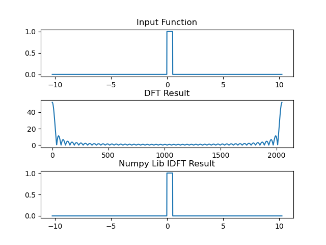
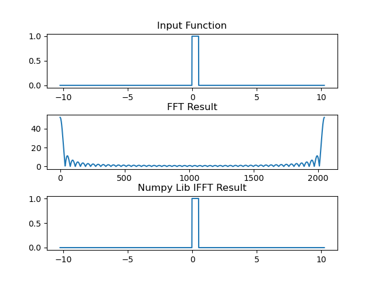

# Intro

This program implements DFT and FFT, and compare my implementations with `np.fft.fft(y)` to prove if it's correct.  

# References

+ https://www.youtube.com/watch?v=toj_IoCQE-4
+ https://towardsdatascience.com/fast-fourier-transform-937926e591cb

# Time Consuming Test

50 times avg.

## Length: 512
```python
DFT time:0.1056001091003418
FFT time:0.019122886657714843
```

## Length: 2048
```python
DFT time:1.0130929708480836
FFT time:0.07974079608917237
```

# Figures



